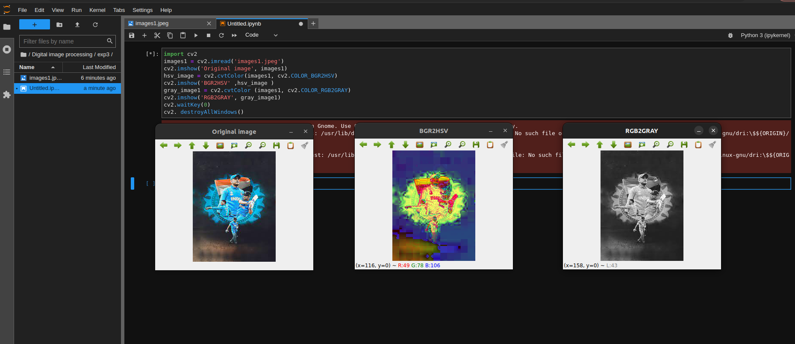
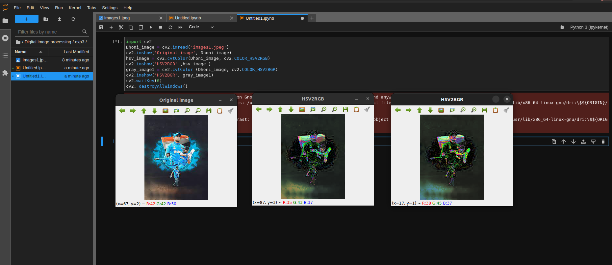
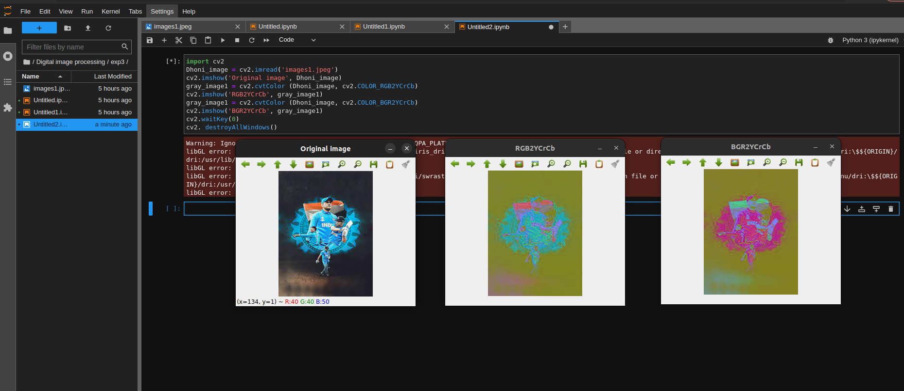
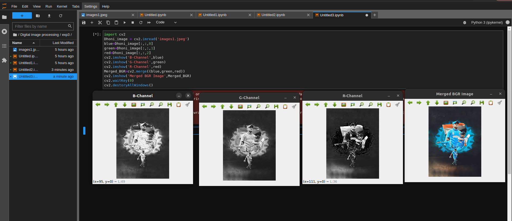
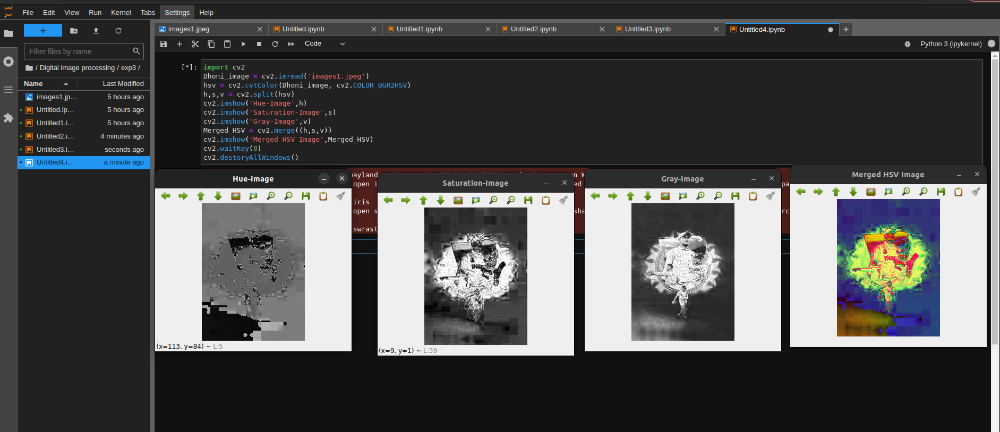

# Color Conversion
## AIM
To perform the color conversion between RGB, BGR, HSV, and YCbCr color models.

## Software Required:
Anaconda - Python 3.7
## Algorithm:
### Step1:
Import cv2 and save and image as filename.jpeg
### Step2:
Use imread(filename, flags) to read the file.
### Step3:
Use cv2.cvtColor(src, code, dst, dstCn) to convert an image from one color space to another.
### Step4:
Split and merge the image using cv2.split and cv2.merge commands.
### Step5:
End the program and close the output image windows.
## Program:
```python
# Developed By: Sai Praneeth K
# Register Number: 212222230067
```
# i) Convert BGR and RGB to HSV and GRAY
```python
import cv2
images1 = cv2.imread('images1.jpeg')
cv2.imshow('Original image', images1)
hsv_image = cv2.cvtColor(images1, cv2.COLOR_BGR2HSV)
cv2.imshow('BGR2HSV' ,hsv_image )
gray_image1 = cv2.cvtColor (images1, cv2.COLOR_RGB2GRAY)
cv2.imshow('RGB2GRAY', gray_image1)
cv2.waitKey(0)
cv2. destroyAllWindows()
```
# ii)Convert HSV to RGB and BGR
```python
import cv2
Dhoni_image = cv2.imread('images1.jpeg')
cv2.imshow('Original image', Dhoni_image)
hsv_image = cv2.cvtColor(Dhoni_image, cv2.COLOR_HSV2RGB)
cv2.imshow('HSV2RGB' ,hsv_image )
gray_image1 = cv2.cvtColor (Dhoni_image, cv2.COLOR_HSV2BGR)
cv2.imshow('HSV2BGR', gray_image1)
cv2.waitKey(0)
cv2. destroyAllWindows()
```
# iii)Convert RGB and BGR to YCrCb
```python
import cv2
Dhoni_image = cv2.imread('images1.jpeg')
cv2.imshow('Original image', Dhoni_image)
gray_image1 = cv2.cvtColor (Dhoni_image, cv2.COLOR_RGB2YCrCb)
cv2.imshow('RGB2YCrCb', gray_image1)
gray_image1 = cv2.cvtColor (Dhoni_image, cv2.COLOR_BGR2YCrCb)
cv2.imshow('BGR2YCrCb', gray_image1)
cv2.waitKey(0)
cv2. destroyAllWindows()
```
# iv)Split and Merge RGB Image
```python
import cv2
Dhoni_image = cv2.imread('images1.jpeg')
blue=Dhoni_image[:,:,0]
green=Dhoni_image[:,:,1]
red=Dhoni_image[:,:,2]
cv2.imshow('B-Channel',blue)
cv2.imshow('G-Channel',green)
cv2.imshow('R-Channel',red)
Merged_BGR=cv2.merge((blue,green,red))
cv2.imshow('Merged BGR Image',Merged_BGR)
cv2.waitKey(0)
cv2.destoryAllWindows()
```
# v) Split and merge HSV Image
```python
import cv2
Dhoni_image = cv2.imread('images1.jpeg')
hsv = cv2.cvtColor(Dhoni_image, cv2.COLOR_BGR2HSV)
h,s,v = cv2.split(hsv)
cv2.imshow('Hue-Image',h)
cv2.imshow('Saturation-Image',s)
cv2.imshow('Gray-Image',v)
Merged_HSV = cv2.merge((h,s,v))
cv2.imshow('Merged HSV Image',Merged_HSV)
cv2.waitKey(0)
cv2.destoryAllWindows()
```
## Output:
### i) BGR and RGB to HSV and GRAY

### ii) HSV to RGB and BGR

### iii) RGB and BGR to YCrCb

### iv) Split and merge RGB Image

### v) Split and merge HSV Image

## Result:
Thus the color conversion was performed between RGB, HSV and YCbCr color models.
